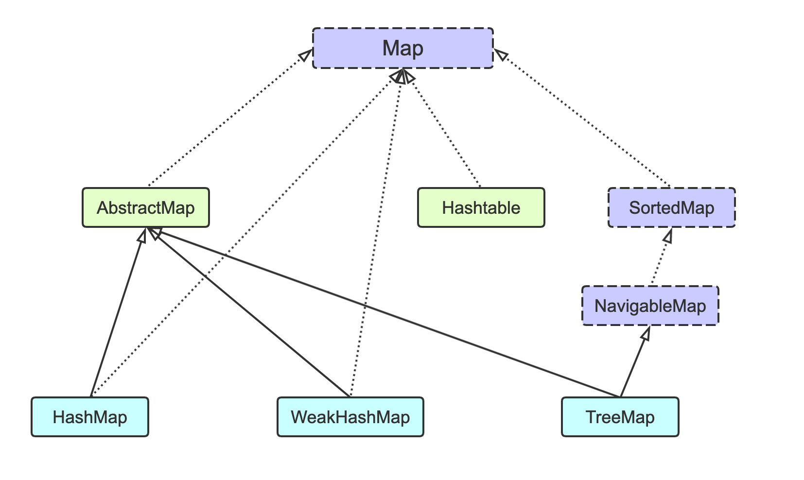
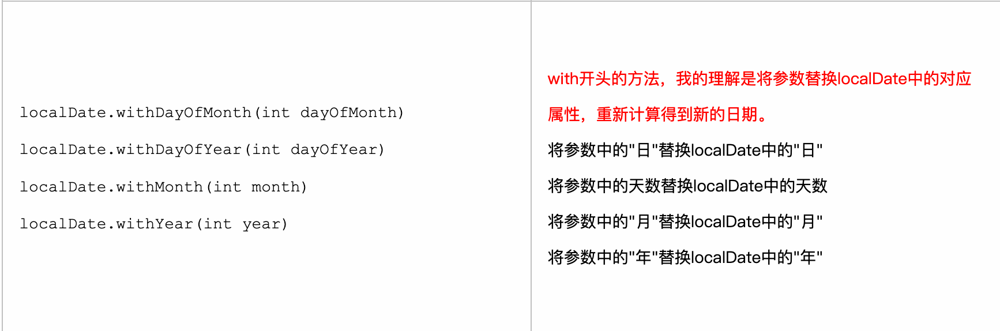

# Java学习笔记


# Effective Java

### Topic2：插件销毁对象

#### 2. 多参数情况

1. 使用重叠构造器；

2. 使用Build模式【构建器】：

   1. new A.Build().set.set.build();

   2. Build模式也适用于类层次结构

   3. 递归类型参数

      ```java
      /*
      * 递归类型参数: java 没有self，为了子类能返回正确的类型【即类型为Build的子类】
      * */ 
      abstract static class Builder<T extends Builder<T>> {
      }
      class BuildA extends Build<BuildA>
      ```

   4. Objects：继承自Object类，自jdk1.7开始有的；工具常用类；类似：Collection vs Collections

      ​		前者是Collection层次结构中的根接口，而“Collections”是一个提供静态方法来处理某些Collection类型的类。 


#### 3. 单例属性

1. 单例模式：

   - 保持构造器私有【private】，并导出【提供外界访问】公有的静态成员
   - 客户端访问唯一实例

2. 方式：

   - final静态公有成员

     ```java
     public static final Singleton instance = new Singleton();
     ```

   - 公有成员是静态工厂方法【饿汉式】

     - 没lazy loading

     ```java
     private static final Singleton instance = new Singleton();
     public static Singleton getInstance() {
     	return instance;
     }
     ```

     - **双重校验**的方式

       ```java
       public class SingletonSafe {
           private static volatile SingletonSafe singleton; // 保证此变量对所有的线程的可见性
       
           private SingletonSafe() {}
           public static SingletonSafe getSingleton() {
               if (singleton == null) {
                   synchronized (SingletonSafe.class) {		//同步锁，synchronized降低效率
                       if (singleton == null) {
                           singleton = new SingletonSafe();
                       }
                   }
               }
               return singleton;
           }
       }
       ```

   - 使用enum【枚举】：不用担心序列化

     ```java
     public enum  Singleton_enum {
         /*
          * 基于枚举类型创建单例模式
          * */
         INSTANCE;
         private String name;
         public String getName(){
             return name;
         }
         public void setName(String name){
             this.name = name;
         }
     }
     ```

#### 4. 通过私有构造器强化不愿实例化的类

- 工具类：只包含静态方法、域
- 缺点，不能子类化

#### 5. 依赖注入-引入资源

1. 依赖多个底层资源

   - 拼写检查器依赖多个字典

2. 依赖注入

   1. 当创建实例时，就将资源传到构造器

      ```java
      public class SpellCheck {
      	private final Dep dep;
      	// 依赖注入
      	public SpellCheck(Dep dep) {
      		this.dep = dep;
      	}
      }
      ```

   2. 资源不可变性：多个客户端共享资源

   3. 适用于构造器、静态工厂、构建器

   4. 依赖注入框架：Spring

3. 不要用单例模式或静态工具来实现依赖多个底层资源的类

4. https://zhuanlan.zhihu.com/p/33492169：玩手机的案例

   ```
   如果一个类A 的功能实现需要借助于类B，那么就称类B是类A的依赖，
   如果在类A的内部去实例化类B，那么两者之间会出现较高的耦合，一旦类B出现了问题，类A也需要进行改造。程序会极难维护，并且很容易出现问题。
   要解决这个问题，就要把A类对B类的控制权抽离出来，交给一个第三方去做，把控制权反转给第三方，就称作控制反转（IOC Inversion Of Control）。
   控制反转是一种思想，是能够解决问题的一种可能的结果，而依赖注入（Dependency Injection）就是其最典型的实现方法。
   由第三方（我们称作IOC容器）来控制依赖，把他通过构造函数、属性或者工厂模式等方法，注入到类A内，这样就极大程度的对类A和类B进行了解耦。
   ```

   

#### 6. 避免创建不必要的对象

 1. 重用单个对象

    ```java
    String s = "xxx";  >>  String s = new String("xxx");
    ```

 2. 静态工厂方法优于构造器

    ```java
    Boolean.valueOf(s); >> Boolean(s);
    ```

3. 缓存重复需要的“昂贵”的类

   - 即 final A a = "";
   - 一个对象时不变的【final】，则可以安全的被重用

4. 慎用延迟初始化：使方法更加复杂，且效果不佳

5. 优先使用基本类型，当心**无意识的自动装箱**【会构造实例，Stream里】

#### 7. 消除过期的对象引用

      	1. 过期引用：不会再被解除的引用【创建数组，抛出的元素即为，栈抛出的】--> 导致内存泄露

 - 无意识的对象保持，GC不会处理该对象，且不会处理其引用的所有对象
        

2. 让包含该引用的**变量结束生命周期**【a = null，告知GC回收】

3. 问题在于：类自己管理内存，就要警惕内存泄露

4. 缓存

   1. WeakHashMap

      - WeakHashMap是`弱引用`，而HashMap`是强引用`

        内存不足的时候，`HashMap`宁可抛出`OutOfMemoryError`异常也不会回收其相应的没有被引用的对象

        而`WeakHashMap`则会回收存储在其中但`key`没有被引用的对象。

      - `WeakHashMap`通过将一些没有被引用的键的值赋值为`null`，告知GC去回收这些存储的值。如果`key`是`null`的话，返回的是`NULL_KEY`这个静态值，不会立马回收。使用`expungeStaleEntries()`方法开始置null。

        ```java
        weakHashMap.put(i, new String("WeakHashMap"));//一直往里面加数据, i未被引用【被其他方法变量】，会被回收	
        
        hashMap.put(i,num);     
        // num 作为hashmap值被引用
        weakHashMap.put(num, new String("WeakHashMap"));//不会被回收
        ```

      - https://blog.csdn.net/zjq_1314520/article/details/78565981

      - 所以当所缓存的项由键决定，用WeakHashMap实现

#### 9. try-with-resources优于try-finally

1. close()的关闭

   1. 之前一直用try-finally，但是当多个资源被访问时，由于try-fianlly都可能抛出异常，当同时抛出时，finally会抹除try异常，追踪不到导致调试困难。https://www.cnblogs.com/kuluo/p/12790648.html	；可通过catch捕获。

      - 问题一：需要显示的调用close
      - 问题二：close函数也有可能抛异常，如果这里抛出异常，try块里面的异常信息就会被丢弃

      ```java
      in = new FileIn();
      try {
      	out = new FileOut();
      	try {
      	} finally {
      		out.close();
      	}
      } finally {
      	// 抛出异常时，会抹除try之前的异常	
      	in.close();	
      }
      ```

   2. try-with-resource

      - 自**java1.7**开始加入了try-with-resource语法并引入了`AutoCloseable`接口，只要相关资源的`类或接口`实现或继承了这个接口，就可以不显式调用close()方法，**自动关闭资源**，并且不会有上述"异常覆盖"的情况发生；变为将try块抛出的异常压缩成Suppressed Exceptions

      - https://www.cnblogs.com/darrenqiao/p/9201357.html

      - 资源处理类已经继承`AutoCloseable`接口

        ```java
        String bufferSugar = null;
        try (BufferedReader readerSugar = new BufferedReader(new FileReader("src/testRead.txt"))) {
        	bufferSugar = readerSugar.readLine();
        	System.out.println(bufferSugar);
        } catch (IOException e) {
          // TODO Auto-generated catch block
          e.printStackTrace();
        }
        ```


### Topic3：通用方法

​	**均是object【超类】下的方法：equals(), hashcode(), toString(), clone(), finalize(),,,**

#### 10 覆盖equals()的约定

1. 不覆盖的情况，【与自身对象【地址】相等】

   - 类的每个实例本质都是唯一的
   - 类没有必要提供“**逻辑相等**”的功能
   - 超类已经覆盖了equals，且对子类也是试用的
   - 类是私有的，或包级私有的，equals不会被调用【即最多单例类，一定相等】

2. 覆盖情况

   - 值类相等

     - Integer， String【final，唯一】
     - 实例受控：至多只存在一个对象的类--》枚举--〉逻辑系统与对象相等是一回事

   - 约定，x != null ， y != null

     - 自反性	x.equals(x) = true

       - [ ] contains()判断

     - 对称性    x.equals(y)  y.equals(x)

     - 传递性 x,y,z

       - [ ] 无法在扩展【继承】可实例化的类的同时，既增加新的值组件，同时又保留equals的约定
       - [ ] 可以使用组合来代替继承：既增加新的值组件，同时又保留equals的约定
       - [ ] 可以在抽象类的子类中：既增加新的值组件，同时又保留equals的约定；因为只要不可以直接实例化超类，就不存在子类与超类比较而违反对称性

     - 一致性：不被修改，始终相等

     - 非空性：x.equals(null) = false【if (o == null) {return false;}】，只需做类型检查【instanceof】而不需要显示进行非空检查

       ```java
       // Java文档定：o=null, 则返回false
       if(!(o instanceof MyType))
       	return false;
       ```

     ```java
     /*equals() 对称性测试*/
     public class Symmetry {
         private final String s;
     
         public Symmetry(String s) {
             this.s = Objects.requireNonNull(s);
         }
     
         @Override
         public boolean equals(Object o) {
             System.out.println(o.getClass() + " instanceof Symmetry ：" + (o instanceof Symmetry));
             // 是否是Symmetry的子类实例 && 将Object 强转为Symmetry
             return o instanceof Symmetry &&
                     ((Symmetry) o).s.equalsIgnoreCase(s);
         }
     
         public static void main(String[] args) {
             Symmetry symmetry = new Symmetry("Hello");
             Symmetry hello = new Symmetry("hello");
             String s = "hello";
     
             System.out.println(symmetry.equals(s));     // false;注意留意返回true,不同对象o instanceof Symmetry
             System.out.println(s.equals(symmetry));     // false  
             System.out.println(symmetry.equals(hello)); // true
           	System.out.println(hello.equals(symmetry)); // true
             
         }
     }
     ```

     ```java
     /*传递性测试*/
     // 原生态 getclass()--测试equals()  仅适用于当对象具有相同的实现类时，使用继承时，但是考虑新增组件
     // 超类Point
     
     public class Point {
         private final int x;
         private final int y;
         public Point(int x, int y) {
             this.x = x;
             this.y = y;
         }
     
         @Override
         public boolean equals(Object o) {
             // 原生态 getclass()--测试equals()
             // 使用继承时，未考虑新增组件
             if (this == o) return true;
             if (o == null || getClass() != o.getClass()) return false;
             Point point = (Point) o;
             return x == point.x && y == point.y;
         }
     
         static class A extends Point {
             private final int c;		// 新增组件
     
             public A(int x, int y, int c) {
                 super(x, y);
                 this.c = c;
             }
         }
     
         public static void main(String[] args) {
             A a = new A(1, 2, 3);
             A b = new A(1, 2, 4);
             System.out.println(a.equals(b));  // 原生态 getclass() true
         }
     }
     ```

     ```java
     /*传递性测试*/
     public class ColorPoint {
         /* 使用组合来代替继承：既增加新的值组件，同时又保留equals的约定 */
         // 私有域 实现组合
         private final Point point;
         private final int c;
     
         public ColorPoint(int x, int y, int c) {
             // 组合
             point = new Point(x, y);
             this.c = c;
         }
     
         @Override
         public boolean equals(Object o) {
             // 如果 o 不是ColorPoint的实例【子类或其对象】，直接false
             if (!(o instanceof ColorPoint))
                 return false;
             ColorPoint that = (ColorPoint) o;
                 return c == that.c && Objects.equals(point, that.point);	// 调用其Point实现方法
         }
     
         public static void main(String[] args) {
             ColorPoint a = new ColorPoint(1, 2, 3);
             ColorPoint b = new ColorPoint(1, 2, 4);
           	ColorPoint c = new ColorPoint(1, 2, 4);
     
             System.out.println(a.equals(b));  // false
           	System.out.println(a.equals(c));  // true
         }
     }
     
     // @since 1.7
     public final class Objects {
         public static boolean equals(Object a, Object b) {
             return (a == b) || (a != null && a.equals(b));
         }
     }
     ```

3. 告诫

   - 覆盖equals是总要覆盖hashCode;
   - 不要企图让equals方法过于智能：进行简单的值域相等；不要陷入等价问题；
   - 不要将equals中的Object对象替换成其他的类型。【没有进行方法覆盖，仅仅是进行了方法重载--方法签名不同；加上@Override】
   - 使用google的AutoValue框架；不要轻易覆盖equals()。
   - 里氏替换原则：一个类型的任何重要属性也将适用于它的子类型。

#### 11. 覆盖equals要覆盖hashcode

   	1. 约定

 	2. 不覆盖
     1. 导致该类无法与基于散列的集合【HashMap， HashSet】一起正常工作；
 	3. 一般准则
     1. 基本类型：Type.hashcode【Integer，装箱基本类型】c
     2. 对象引用：递归调用，null-0；c
     3. 数组：对每个元素单独域进行处理
     4. 整合：result = result * 31 +c
        - 乘法：散列值依赖于域【equals涉及的属性】的顺序
        - 31：奇素数 && 【31 * i == (i << 5) - i】补码左移 https://www.cnblogs.com/chuijingjing/p/9405598.html
     5. Objects.hash()：静态方法，动态参数生成hashcode；较慢，需要创建数组，基本类型涉及装箱拆箱
 	4. 对于不可变类，且计算散列值开销较大，可考虑将散列码缓存在对象内部

```java
// 官方jdk--class String

private int hash; // Default to 0
public int hashCode() {
  int h = hash; 		// 缓存
  if (h == 0 && value.length > 0) {
    char val[] = value;

    for (int i = 0; i < value.length; i++) {
      h = 31 * h + val[i];
    }
    hash = h;
  }
  return h;
}
```

#### 12. 始终要覆盖toString()方法

1. Object的toString：类名@散列码的无符号16进制

   ```java
   com.topic3.equals.Standard@60e53b93
   ```

2. 提供好的实现【覆盖】使类使用更加舒适，更易于调试【诊断信息】

#### 14. 考虑实现Comparable接口

1. lang包下，仅包含`compareTo`方法【a.compareTo(b)】

2. 同equals约定与限制：无法在用新的值组件扩展可实例化类的同时，保持compareTo的约定，组合解决

3. TreeSet, TreeMp, 工具类：Collections, Arrays

   ```java
   import static java.util.Comparator.comparingInt;    // 静态导入 1.5
   
   public class Standard implements Comparable<Standard>{
     // 多关键域比较，静态导入，比较器构造方法
       private static final Comparator<Standard> comparator = comparingInt((Standard sd) -> sd.code)
               .thenComparingInt(pn -> pn.prefix).thenComparingInt(pn -> pn.line);
     @Override
     public int compareTo(Standard sd) {
       return comparator.compare(this, sd);
     }
   }
   
   ```

### Topic4：类与接口

#### 15. 使类和成员的可访问性最小化

1. 封装【信息隐藏】：组件隐藏所有实现细节，即API与实现分离开，且组件之间只通过API进行通信。解耦。
2. 顶层类和接口：包级访问接口【默认，缺省】，或者public
3. 成员：域，方法，嵌套类，嵌套接口
   - private
   - 包级访问default：缺省默认，声明该包下类可访问
   - protected: 子类及包内部可访问
   - public
4. 如果方法覆盖超类中的方法，则子类中的访问级别不能低于超类中的访问级别
5. 公有类的实例域不能使公有的，包含公有可变域的类通常不是线程安全的。

#### 17. 使可变性最小化

1. 不可变类：指实例不能被修改的类【final】
   1. 所需信息在创建时提供
   2. String，基本类型包装类，BigInteger
   3. 规则
      - 保证类不会被扩展
      - 所有域【属性】为final，private
   4. 不可变对象是线程安全的，不要求同步，因为多个线程并发访问不可变对象
2. 可提供可变配套类：StringBuilder【1.5】
3. 除了final实现不可变：还可--让类所有**构造器**变为私有或者**包级私有**【默认缺省】，并添加**公有静态工厂**方法。

#### 18. 复合优于继承

1. 继承

   - 代码重用的有力手段
   - 在包的内部使用继承是安全的，
   - 对于跨越包继承，则是非常危险的，
   - 继承打破了封装性：子类依赖于超类
   - HashSet->AbstractCollection->Collection，其addAll()调用add，自用性，很脆弱【伴随版本发行可能不同，导致子类不知道】
   - 当继承添加新方法时，父类发行版本添加了相同方法，就变成了覆盖【不可控性】
   - 只有当子类真正是超类的子类型时，才使用继承`is-a`
   - 违背了**封装原则**

2. 组合

   - 解决上述问题

   - 不扩展现有的类，而是在**类中增加一个私有域【属性】**，引用现有类的一个实例，**将现有类变成了新类的组件**

   - 转发

     - 新类中的实例方法调用现有类的方法并返回它的结果，新类中的方法称为转发方法

   - 包装类：一个类将另一个类包装

     - ```java
       public class InstrumentedSet<E> extends ForwardingSet<E> {
           private int addCount = 0;						// 扩展
       
           public InstrumentedSet(Set<E> s) {	// 包装
               super(s);
           }
       }
       ```

     - **修饰者模式**：对另一个进行了修饰，增加了特性功能

     - **委托**：包装对象将**自身传递给被包装对象**

     - 包装类不适合用于回调框架【对象将自身的引用传递给其他对象】

   - has-a关系，复合

     - Java平台库中，Stack不应该扩展Vector，Properties不应该扩展HashTable，违反is-a原则

   - 复合允许新的API隐藏旧API中的缺陷

3. 原则

   - 当子类和超类处在不同包中，并且超类并不是为了继承而设计的，就可以用**复合和转发机制**来代替继承

#### 19. 设计继承并提供文档

1. @implSpec： Java1.8增加，方法调用到可覆盖方法

   - 可覆盖方法：指非final、public、protected的

2. 超类构造器绝不能调用可被覆盖的方法

   - 直接或间接均不可

   - **超类的构造器在子类的构造器之前运行**，所以，**子类覆盖的方法**会在子类构造器运行之前**先被调用**，如果该覆盖方法依赖与子类构造器中属性火初始化工作，则覆盖方法不会如期执行

   - 通过构造器调用**私有方法，final方法或静态方法**是安全的，因为这些都是不可覆盖的方法

     ```java
     public class Super {
       Super() {
         overMe();		// 不正确
       }
       public void overMe() {}
     }
     ```

3. 对于并非为了继承而设计的普通类

   - 最好final
   - 或者构造器都变为private，或者默认【包级私有】，并增加公有静态方法代替构造器

#### 20. 接口优于抽象类

**接口是对动作的抽象，抽象类是对根源的抽象。**  

Java1.8 接口提供默认实现，缺省方法【default】

1. **现有的类**可以很容易被更新，以实现**新的接口**

   - 一半来说无法更新现有的类来扩展新的抽象类，会间接破坏层次结构
   - 例如：Comparable，Autocloseable接口被引入，更新了许多现有类【implements】

2. 接口是定义混合类型[mixIn]的理想选择

3. 接口允许构造非层次结构的类型框架

   ```java
   // 歌唱家
   public interface Singer {
     Audio sing(Song s);
   }
   // 作曲家
   public interface Songwriter {
     Song compose(int po);
   }
   //即是也是
   public interface Both extends Singer, Songwriter {
     // 提供新方法
     void act();
   }
   ```

4. 接口使得安全地增强类的功能

   1. 包装类模式
   2. 如果是抽象类，必须只能继承，就要考虑继承的相关问题

5. 模板方法模式

   1. 对接口提供一个**抽象类的骨架实现**

   2. 接口负责定义类型，或提供一些缺省方法，

   3. 骨架实现类则负责实现非基本类型接口方法

   4. **骨架实现类**：AbstractInterface，Collections框架为每个集合接口都提供了一个骨架实现【**抽象方法**】

      - AbstractCollection， AbstractSet

      - AbstractList， AbstractMap

      - **接口不能为Object方法【equals,hashcode】的提供缺省实现**，所以所有实现都放在骨架实现类中。

      - 骨架实现类是为了继承的目的而设计的，所以应该提供好的文档

        ```java
        // 骨架实现类
        public abstract class AbstractMap<K,V> implements Map<K,V> {
          // 简单实现  
          public static class SimpleEntry<K,V> implements Map.Entry<K,V> {
              
            }
        }
        ```

      - 建议：如果设计一个接口，就应该坚决同时提供框架实现类。而且，尽可能在接口在通过缺省方法提供骨架实现，以便实现类可以使用。

#### 21. 为后代设计接口

1. Java8之后，接口提供缺省方法【默认实现】，目的是为了便于使用lambda，但是这些方法是被“注入”到现有实现中的，不一定都表现良好。

   1. **断言【谓词】：Predicate**

   ```java
   // removeIf
   public static void main(String[] args) {
     List<Integer> list = new ArrayList(Arrays.asList(1, 2, 3));
     list.removeIf((Integer i) -> i % 2 == 0);
     System.out.println(list);
   }
   ```

2. 有了缺省方法，接口的现有实现就不会出现**编译时没有报错或警告**，但运行时却失败的情况

   - 尽量避免利用缺省方法在**现有接口**上添加新方法【可能破坏现有实现】，但是，在**创建接口**时尽量默认实现。

#### 22. 接口只用于定义类型

1. 简而言之，**接口应该只被用来定义类型，不应该被用来导出常量**
2. java接口里的**成员变量默认**只能**是public 的，static 的，final**的；并且必须赋初值，否则通不过编译。
3. 接口就是提供一种统一的”协议”，而**接口中的属性**也属于“协议”中的成员。**它们是公共的，静态的，最终的常量**。相当于全局常量。抽象类是不“完全”的类，相当于是接口和具体类的一个中间层。即满足接口的抽象，也满足具体的实现。 
4. 如果要进行**修改**的话，定义在**接口具体实现类**中。
5. **方法的默认修饰符**是：public abstract
6. **内部接口**默认修饰符：public static

#### 23. 类层次优于标签类

1. 标签类：【tagged class】一个类描述了多种抽象，可以根据某个field决定不同的实例。
2. 类层次：即**继承**抽象类

#### 24. 静态成员类优于非静态成员类

1. 嵌套类

   - 定义在一个类内部的类，存在的目的是**为外围类服务**，如果用于其他环境，则应该是顶层类
   - 组成
     - 静态成员类
     - 内部类：非静态成员类，匿名类，局部类

2. 静态成员类

   - 可看着普通的类，static，是外围类的一个静态成员，独立存在

   - 可以访问外围类的所以成员，**包括private**

   - 代表外围类所代表对象的组件；Entry：代表Map中的每个键值对

     ```java
     public interface Map<K,V> {
       // 内部接口默认修饰符 public static
       interface Entry<K,V> {}
     }
     ```

     

3. 非静态成员类

   - 其每个实例隐含一个外围实例
   - 在其内部，可以调用外围实例的方法，或者通过**this获得外围实例的引用**
   - 当其被创建时，与外围类的关联关系就建立了，该关系需**消耗**非静态成员类实例的**空间**，并**增加**构造的**时间**
   - 在外围实例符合垃圾回收时，其引用关系【不可见】仍会被保留，导致内存泄漏。

#### 25. 限制源文件为单个顶级类

1. 永远不要把多个顶级类或者接口放在一个源文件中，

   - 程序的结果行为，取决于传给编译器时的顺序

2. 方法

   - 将类分到独立源文件中

   - 使用静态成员类

     

### Topic5：泛型

#### 26. 不要使用原生态类型

1. 类型参数List`<T>`, `<E>`

   - E的列表
   - 泛型类与接口统称泛型
   - Java5开始

2. 原生态类型

   - 不带参数的泛型名称
   - List<T>的原生态类型是List
   - 存在是为了兼容之前的版本
   - 使用原生态**插入非同类型**时，**编译时不会报错**，仅有提示，但是在运行时会报异常
   - 出错之后应该尽快发现，最好在编译时就发现
   - 使用原生态类型，就失掉了**泛型在安全性和描述性方面的所有优势**
   - **逃避泛型检查，不安全**

3. 无限制的通配符类型

   - **List<?>**
   - 在需要使用泛型，但**不确定或者不关心实际的类型**参数时使用
   - 读：某个类型的集合
   - 泛型中通配符
     - 常用的 T，E，K，V，？
     - ？无界通配符：
     - 上界通配符 < ? extends E>
     - 下界通配符 < ? super E>
     - ？表示不确定的 java 类型；T (type) 表示具体的一个java类型；K V (key value) 分别代表java键值中的Key Value；E (element) 代表Element
     - https://www.cnblogs.com/minikobe/p/11547220.html
   - 不能将任何元素（除了null）放到Collection<?>中

4. 使用原生态

   - 类文字中

     - xxx.class

   - instanceof

     - ```java
       if (o instanceof List) {
         List<?> list = (List<?>) o;
       }
       ```

   ```java
   /**
    * 泛型方法
    * <E> 在返回类型前面，代表输入参数带有泛型
    */
   public static <E> List<E> test(E[] a, List<E> list) {
     return list;
   }
   ```

5. | 术语             | 示例                              |
   | ---------------- | --------------------------------- |
   | 参数化的类型     | List<String>                      |
   | 实际类型参数     | String                            |
   | 泛型             | List<E>                           |
   | 形式类型参数     | E                                 |
   | 无限制通配符类型 | List<?>                           |
   | 原生态类型       | List                              |
   | 有限制类型参数   | <E extends Number>                |
   | 递归类型限制     | <T extends Comparable>            |
   | 有限制通配符类型 | List<? extends Number>            |
   | 泛型方法         | static <E> List <E> asList(E[] a) |
   | 类型令牌         | String.class                      |

#### 27. 消除非受检的警告

1. SuppressWarnings注解

   - 确定代码是安全的

   - 提供注释

     ```java
     @SuppressWarning("unchecked")
     ```

#### 28. 列表优于数组

1. **列表在编译时就发现错误**， 而数组在运行时才发现错误

   - 应该越早发现错误越好

   - 数组是协变的：即如果Sub【String】是Super【Object】的子类型，则Sub[] 就是Super[]的子类型

     ```java
     //数组协变的  Long 是Object的子类型
     Object[] obj = new Long[1];
     // 运行时才报错
     obj[0] = "12213";
     ```

   - 列表【泛型】是可变的

     - 即对于**任意类型**T1与T2，List<T1>与List<T2>没有超类子类一说，即编译不通过

     ```java
     //列表【泛型】可变的, 编译不通过
     List<Object> longs = new ArrayList<Long>();
     ```

2. 区别2

   - 数组时具体化的：即数组会在运行时知道和**强化**它们的元素类型，运行时检查，抛出异常
   - 泛型则是通过擦除实现
     - **擦除**：使泛型可以与没用使用泛型的代码随意进行互用，即**兼容Java5之前**
     - 泛型是**只在编译时强化类型信息**，并在运行时丢弃【擦除】元素类型信息

3. 没有泛型数组存在

   - 由于以上区别，创建泛型数组是非法的

   - ```java
     List<String>[] a = new ArrayList<>[1];
     ```

   - 创建**无限制通配类型**的数组是合法的<?>

4. 结

   - 数组是协变且可以具体化的
     - 提供了运行时的类型安全，但是没有编译时的类型安全
     - 直接取数据较快
   - 列表【泛型】是不可变且可以擦除的
     - 提供了编译时安全，但是没有运行时安全【类型擦除】

#### 29. 优先使用泛型

1. 泛型类

   ```java
   public class Gene<E> {
       private E element;
   }
   ```

   

#### 30. 优先考虑泛型方法

理论较难

1. 泛型方法

   ```java
   /*
    * <E> : 类型参数列表
    * Set<E> : 返回类型
    * 先参数列表，在返回类型
    * 该方法缺点在于三个集合类型必须相同，应该利用有限制的通配符类型<? >
    * */
   public static <E> Set<E> union(Set<E> a, Set<E> b) {
     Set<E> result = new HashSet<>(b);
     result.addAll(a);
     return result;
   }
   ```

   - 类型参数列表

     ```java
     // E必须是Super的实例或子类型，有限制的通配符类型参数
     <E extends Super>
     ```

#### 31. 使用有限通配符

1. 参数化类型是不变的，即两个不同类型T，之间没有子超类型关系

   1. union方法缺点在于**三个集合类型必须相同**

2. E的某个子类型

   - <? extends E>
   - extends：确定子类型后，每个类型便都是**自身的子类型**，即**没有将自身扩展**
   - **生产者**

   ```java
   /**
    * E 的某个子类型的Iterable接口
    * @param src 产生E实例供Stack使用
    */
   public void pushAll(Iterable<? extends E> src) {
     for (E e : src) {
       push(e);
     }
   }
   
   public static void main(String[] args) {
     StackTest<Number> test = new StackTest<>();
     // Integer extends Number
     Iterable<Integer> integers = Arrays.asList(1, 2, 3);
     test.pushAll(integers);
     // Double extends Number
     Iterable<Double> dIterable = Arrays.asList(1.0, 2.0, 3.0);
     test.pushAll(dIterable);
   }
   ```

3. E的某种超类的集合

   - <? super E>

   - 超类是确定的，因为E是他本身的一个超类型

   - 消费者

     ```java
     /**
      * E 的某个超类的集合
      * @param dst 消费E实例
      */
     public void popAll(Collection<? super E> dst) {
       while (isEmpty()) {
         dst.add(pop());
       }
     }
     
     
     // Object E的超类
     Collection<Object> objects = new ArrayList<>();
     test. popAll(objects);
     ```

     

4. 上论：为了获得最大限度灵活性，要在表示生产者或消费者的输入参数上使用通配符类型

   - 即是生产者又是消费者，就应该需要严格的类型匹配

   - **PECS：producer-extends，consumer-super**

   - Comparable，Comparator始终是消费者：<? super T>；

     ```java
     // 类型参数列表  返回类型  方法名
     public static <T extends Comparable<? super T>> T max(List<? extends T> list)
     ```

#### 32. 谨慎同时使用泛型与可变参数

1. 可变参数：Java5

   1. 会创建一个数组存放可变参数

   2. 如果方法**没有在数组中保存任何值**，也不允许对数组的引用转义，该方法就是安全的

   3. 将值保存到**泛型可变参数数组参数**中是不安全的，即**数组参数中不应该保存值**

      ```java
      static void test(List<String... lists){}
      ```

   ```java
   Arrays.asList(T... a)
   Collections.addAll(Collection<? super T> c, T... e)
   ```

2. 使用静态方法代替泛型可变参数

   ```java
   Arrays.asList(1, 2, 3)
   List.of(1, 2, 3)
   ```

   

#### 33. 优先考虑类型安全的异构容器

1. 异构容器：所有键是不同类型的；异构就是不同结构

   ```java
   /**
    * @Author LJ
    * @Date 2020/11/19
    * msg 类型安全的异构容器
    */
   public class Favorites {
       // 键不同类型，异构
       private Map<Class<?>, Object> map = new HashMap<>();
   
       public <T> void put(Class<T> type, T instance) {
           map.put(Objects.requireNonNull(type), instance);
       }
   
       public <T> T get(Class<T> type) {
           // return (T) obj; 动态转换
           return type.cast(map.get(type));
       }
   
       public static void main(String[] args) {
           Favorites f = new Favorites();
           f.put(String.class, "Java");		// 类型令牌
           f.put(Integer.class, 0xcafebabe);
           f.put(Class.class, Favorites.class);
           String favoriteString = f.get(String.class);
           int favoriteInteger = f.get(Integer.class);
           Class<?> favoriteClass = f.get(Class.class);
           System.out.printf("%s %x %s%n", favoriteString,
                   favoriteInteger, favoriteClass.getName());
       }
   }
   ```

   1. 类型令牌：当一个类的字面被用于方法中，在传达编译时和运行时的类型信息
   2. 将键进行参数化以实现更大灵活性
   3. 该类是安全的，因为请求String时，不会返回Integer；异构的，键不同类型【不同普通映射】

2. 局限

   1. 恶意的客户端可以通过以原生态形式（raw form）使用class对象轻松地破坏类型安全。为了确保在运行时类型安全可以在使用动态转换（dynamic cast）

      ```java
      public <T> void put( Class<T> key, T value ) {
        // // return (T) obj; 动态转换
        values.put( key, key.cast( value ) );
      }
      ```

   2. 不能用在不可具体化的类型中，即不能保存`List<String>`，因为`List<String>.Class`语法错误，正确表达`List.Class`，但是破坏了Favorites内部结构

3. 结：

   - 泛型常用于集合，如`Set<E>`等等，这些用法中，**泛型都充当被参数化了的容器**
   - 集合API【原始提供的】限制每个容器只能有固定数目的类型参数，但是可以通过将**类型参数放在键上**而不是容器上来避免这限制【即异构容器】
   - 对于这种类型安全的异构容器，可以用Class对象充当键，即**类型令牌**
   - 也可以使用定制的键类型，如使用`DatabaseRow`类型表示数据库的行【容器】，用泛型`Column<T>`作为其键【异构】


### Topic6：枚举与注解

Java支持两种特殊的引用类型

- 枚举类型，类
- 注解类型，接口

#### 34. 用enum代替int常量

```java
package java.lang;
/*官方源码*/
public abstract class Enum<E extends Enum<E>>
        implements Comparable<E>, Serializable {
}
```

##### 1. Java的枚举**本质是int值**

- 真正的final类，不能创建实例，不能扩展，**仅存在枚举实例**，只存在声明的常量，即**实例受控**的

- 是单例的泛化

- 编译时的类型安全：试图传递错误值编译错，试图==编译错

- 可以有不同枚举类型的同名常量，因为每个类型有自己的命名空间

- 可以重新排列枚举类型中的常量，而无需重新编译客户端代码

- 枚举构造器

  - 需要在**枚举实例后面加上分号**，**之间用逗号**，然后再写构造函数等
  - 枚举实例必须在前面
  - 定义枚举的构造器方法带参, 默认且只能为private

  ```java
  public enum Apple {
    	// 枚举实例
      FUJI, PIPP;
      // final private
      private final String string = "21";
      // 构造器 默认且只能为private
      private Apple(){}
      private Apple(String a) {}
  }
  ```

##### 2. 除了完善int枚举模式，枚举类型还允许

- 添加**任意的方法和域**【属性，字段】
- **实现任意的接口**
- 提供了**Object方法的高级实现**【equals, hashcode】
- 实现了Comparable接口和Serializable接口，并针对枚举类型的可任意性**设计了序列化方式**


##### 3. 为了将**数据与枚举常量关联**起来，

- 得声明实例属性，并编写**构造器**初始化实例域

- 枚举所有域都**应该是**final的，**最好**private，提供公有访问方法

  ```java
  /* 数据与枚举常量关联
   * 先枚举常量，在写其他
   */ 
  public enum Planet {
    	// 枚举实例-常量[static，final]，供外部访问，对应构造方法
      MERCURY(3.302e+23, 2.439e6),
      EARTH  (5.975e+24, 6.378e6),
  
    	/* 实例域，MERCURY及EARTH的属性，private */
      private final double mass;           // In kilograms
      private final double radius;         // In meters
    	// 数据与枚举常量关联
      private final double surfaceGravity; // In m / s^2
  
      // 静态private域
      private static final double G = 6.67300E-11;
  
      // 构造器，默认且只为private，为了数据与枚举常量关联
      Planet(double mass, double radius) {
          this.mass = mass;
          this.radius = radius;
          surfaceGravity = G * mass / (radius * radius);
      }
  
    	/*枚举方法*/
      public double mass()           { return mass; }
      public double radius()         { return radius; }
      public double surfaceGravity() { return surfaceGravity; }
  
      public double surfaceWeight(double mass) {
          return mass * surfaceGravity;  // F = ma
      }
  }
  ```

  ```java
  public static void main(String[] args) {
    double earthWeight = Double.parseDouble("100");
  
    double mass = earthWeight / Planet.EARTH.surfaceGravity();
    // values返回声明顺序的值数组
    final Planet[] values = Planet.values();  // [MERCURY, EARTH]
    // valueOf方法
    System.out.println(Planet.valueOf("EARTH").mass());
    // toString()实现为枚举值的名称
    System.out.println(Planet.EARTH);
  
    for (Planet p : Planet.values())
      System.out.printf("Weight on %s is %f%n",
                        p, p.surfaceWeight(mass));
  }
  ```

##### 4. 组合枚举类，或顶层枚举类

1. ```java
   public enum RoundingMode {}
   
   public class BigDecimal
       public BigDecimal divide(BigDecimal divisor, int scale, RoundingMode roundingMode) {
           return divide(divisor, scale, roundingMode.oldMode);
       }
   }
   ```


##### 5. 不同行为与每个常量关联

- **特定于常量的方法实现**：abstract

- 枚举类中定义一个抽象方法，然后**枚举类型中每个常量**实现以覆盖该方法

- 添加新常量时，编译器会提醒添加新实现

- 缺点：共享代码变得困难，即需要太多重复代码，**策略模式**解决之

  ```java
  // 计算器
  public enum Operation {
      PLUS {
          @Override
          public double apply(double x, double y) {
              return x + y;
          }
      },
      MINUS {public double apply(double x, double y) {
              return x - y;
          }},
      TIMES {public double apply(double x, double y) {return x * y; }},
      DIVIDE {public double apply(double x, double y) {
              return x / y;
          }};
  
      /*
      * 定义抽象方法，表示不同行为
      * 每个常量实现覆盖之
      * */
      public abstract double apply(double x, double y);
  
      public static void main(String[] args) {
          final double apply = Operation.PLUS.apply(1, 2);
          System.out.println(apply);
      }
  }
  ```

##### 6. 特定于常量的方法实现与特定于常量的数据结合

- 特定于常量的数据：构造器

- 特定于常量的方法实现：抽象方法

  ```java
  public enum Operation {
  
      /*
      * 常量
      * 构造器连接数据()
      * 覆盖抽象方法
      * */
      PLUS("+") {
          @Override
          public double apply(double x, double y) {
              return x + y;
          }
      },
      MINUS("-") {public double apply(double x, double y) {
              return x - y;
          }},
      TIMES("*") {public double apply(double x, double y) {return x * y; }},
      DIVIDE("/") {public double apply(double x, double y) {
              return x / y;
          }};
  
    	// 数据
      private final String symbol;
      /*
      * 特定于常量的数据
      * 构造器
      * */
      Operation(String symbol) {this.symbol = symbol;}
  
      /*
      * ==特定于常量的方法实现==
      * 定义抽象方法，表示不同行为
      * 每个常量实现覆盖之
      * */
      public abstract double apply(double x, double y);
  
      public static void main(String[] args) {
          final Operation operation = Operation.valueOf("MINUS");
          final double apply1 = operation.apply(1, 2);
      }
  }
  ```

##### 7. 策略模式

- 解决**特定常量的方法实现**中**共享代码**难问题
- 如果用switch，当增加新常量时，**忘记写case，编译可通过**，但是结果会不对
- 想法：每添加一个常量，就**强制选择相应策略**，即编译不通过
- 实现：**私有嵌套枚举**


##### 8. 结

- 使用枚举：需要一组固定常量，并且**在编译时**就知道其成员时；int枚举在运行时才知，不安全
- 枚举类型中的常量集并非要始终保持不变
- 在**多个枚举常量同时**共享**相同行为**时，考虑使用**策略枚举**，**否之有特定于常量**的方法实现

#### 38. 用接口模拟可扩展的枚举

1. 虽然**无法编写可扩展的枚举类型**，却可以通过**编写接口以及实现该接口的基础枚举**类型来对他进行模拟


#### 39. 注解优于命名模式

1. 一般使用命名模式表明程序元素需要通过某种工具或者框架进行特殊处理，例如JUnit的测试方法

2. 注解：https://www.runoob.com/w3cnote/java-annotation.html

   - Java 注解（Annotation）又称 Java 标注，是 **JDK5.0** 引入的一种注释机制。

   - Java 语言中的**类、方法、变量、参数和包**等都可以被标注。注解可以通过**反射**获取注解内容。在编译器生成类文件时，标注可以被嵌入到字节码中。

   - 内置的注解

     - Java 定义了7个注解，3 个在 java.lang 中，剩下 4 个在 java.lang.annotation 中；后来新增了3个

     - **作用在代码的注解是**

       - @Override - 重写方法。
       - @Deprecated - 过时方法；编译警告。
       - @SuppressWarnings - 指示编译器去忽略警告。

     - **作用在其他注解的注解*(元注解*)**，自定义注解时使用

       - @Retention - **标识这个注解怎么保存**，是只在代码中，还是编入Class文件中，或者是在运行时可以通过反射访问。

         ```java
         @Documented
         @Retention(RetentionPolicy.RUNTIME)
         @Target(ElementType.ANNOTATION_TYPE)
         public @interface Retention {
             /**
              * Returns the retention policy.
              * @return the retention policy
              */
             RetentionPolicy value();
         }
         
         public enum RetentionPolicy {
             SOURCE,    /* Annotation信息仅存在于编译器处理期间，编译器处理完之后就没有该Annotation信息了  */
             CLASS,     /* 编译器将Annotation存储于类对应的.class文件中。默认行为  */
             RUNTIME    /* 编译器将Annotation存储于class文件中，并且可由JVM读入 */
         }
         ```

       - @Target - 标记这个**注解应该是哪种 Java 成员**(类，方法，属性...)，**缺省任何地方**。

         ```java
         public @interface Target {
             ElementType[] value();
         }
         
         public enum ElementType {
             TYPE,               /* 类、接口（包括注释类型）或枚举声明  */
             FIELD,              /* 字段声明（包括枚举常量）  */
             METHOD,             /* 方法声明  */
             PARAMETER,          /* 参数声明  */
             CONSTRUCTOR,        /* 构造方法声明  */
             LOCAL_VARIABLE,     /* 局部变量声明  */
             ANNOTATION_TYPE,    /* 注释类型声明  */
             PACKAGE             /* 包声明  */
             /**
              * Type parameter declaration
              * @since 1.8
              */
             TYPE_PARAMETER,
             /**
              * Use of a type
              * @since 1.8
              */
             TYPE_USE
         }
         ```

       - @Inherited - 标记这个注解是继承于哪个注解类(默认 注解并没有继承于任何子类)

       - @Documented - 标记注解出现在用户文档中，**默认不出现**。

     - **从 Java 7 开始，新增了 3 个注解**:

       - @SafeVarargs - Java7 开始，忽略任何使用参数为泛型变量的方法或构造函数调用产生的警告。
       - @FunctionalInterface - Java 8 开始，标识一个**匿名函数或函数式接口**。
       - @Repeatable - Java 8 开始支持，标识**某注解**可以在同一个声明上**使用多次**。

     

     - 架构

       

     - **Annotation**

       - 每 1 个 Annotation 对象，都会有唯一的 RetentionPolicy 【保留策略】属性； 1~n个ElementType 属性

       - 与一般实现不同，Annotation 接口的实现细节都由**编译器完成**。通过`@interface` 定义注解后，该注解**不能继承其他的注解或接口。**

         ```java
         package java.lang.annotation;
         /*The common interface extended by all annotation types.*/
         public interface Annotation {
             boolean equals(Object obj);
             int hashCode();
             String toString();
             Class<? extends Annotation> annotationType();
         }
         ```

         

     - **自定义注解**

       - ```java
         @Documented														// 表示该注解出现在Javadoc中，无则默认不出现
         @Target(ElementType.TYPE)							// 类型属性，作用于的地方，无则默认任何地方
         @Retention(RetentionPolicy.RUNTIME)		// 保留策略，无则默认.class文件
         public @interface MyAnnotation {}
         ```

       - **@interface**：即实现了Annotation接口，必须声明；

     - 作用

       - Annotation 是一个辅助接口，它在 Junit、Struts、Spring 等工具框架中被广泛使用。

       - 编译检查

       - 根据 Annotation 生成帮助文档

       - 在反射中使用 Annotation

         ```java
         package com.topic6.anno;
         
         import java.lang.annotation.Annotation;
         import java.lang.annotation.Retention;
         import java.lang.annotation.RetentionPolicy;
         import java.lang.reflect.Method;
         
         /**
          * @Author LJ
          * @Date 2020/11/21
          * msg 注解在反射函数中的使用示例
          */
         
         // 指明保留策略
         @Retention(RetentionPolicy.RUNTIME)
         @interface MyAnnotation {
             // 定义@MyAnnotation(value={}) 默认值
             String[] value() default "Unknown";
         }
         
         class Person {
             /**
              * empty()方法同时被 "@Deprecated" 和 "@MyAnnotation"所标注
              * 1. @Deprecated, 该方法不再被建议使用
              * 2. @MyAnnotation, 该方法对应的MyAnnotation的value值是默认值"unknown"
              */
             @MyAnnotation
             @Deprecated
             public void empty() {
                 System.out.println("empty()");
             }
         
             /**
              * MyAnnotation的value值是{"girl","boy"}
              */
             @MyAnnotation(value = {"girl", "boy"})
             public void somebody(String name, int age) {
                 System.out.println("somebody(): " + name + ", " + age);
             }
         }
         
         
         public class AnnotationReflect {
             public static void main(String[] args) throws Exception{
                 final Person person = new Person();
                 Class<Person> c_p = Person.class;
                 // 指明类型以防重载 Method-->package java.lang.reflect;
                 Method somebody = c_p.getMethod("somebody", String.class, int.class);
                 // 执行该方法, 可变参数
                 somebody.invoke(person, new Object[]{"XJJ", 20});
                 reflect(somebody);
         
                 System.out.println();
                 Method empty = c_p.getMethod("empty", new Class[]{});
                 empty.invoke(person, new Object[]{});
                 reflect(empty);
         
             }
         
             public static void reflect(Method method) {
                 // 判断方法是否包含对应注解
                 if (method.isAnnotationPresent(MyAnnotation.class)) {
                     // 获取该注解实例
                     MyAnnotation myAnnotation = method.getAnnotation(MyAnnotation.class);
                     String[] value = myAnnotation.value();
                     System.out.print("MyAnnotation(value): ");
                     for (String v : value) {
                         System.out.print(v + ", ");
                     }
                     System.out.println();
                 }
         
                 // 获取方法上的所有注解，并打印
                 System.out.println("该方法包含注解： ");
                 Annotation[] annotations = method.getAnnotations();
                 for (Annotation annotation : annotations) {
                     System.out.println(annotation);
                 }
             }
         }
         ```

         

#### 41. 用标记接口定义类型

标记接口：指不包含方法声明的接口，它只是指明一个类实现了具有某种属性的接口，如Serializable接口

```java
public interface Serializable {
}
```


### Topic7：Lambda与Stream

在Java8中，增加了函数式接口【有且仅有一个未实现接口，Lambda默认实现之】，Lambda、方法引用、Stream API

#### 42. Lambda优于匿名类

1. 策略模式

   - Comparator接口代表一种排序的**抽象策略**，匿名类则是为字符串排序提供一种**具体策略实现**

     ```java
     // 匿名类实现，繁琐
     public static void sort(List<String> words) {
       Collections.sort(words, new Comparator<String>() {
         @Override
         public int compare(String o1, String o2) {
           return Integer.compare(o1.length(), o2.length());
         }
       });
     }
     ```

2. 函数式接口：带有单个抽象方法的接口

   - Java允许利用Lambda表达式创建这些接口的实例

     ```java
     // lambda表达式
     Collections.sort(words, (s1, s2) -> Integer.compare(s1.length(), s2.length()));
     ```

3. 类型推导

   - 支持泛型类型，不要使用**原生态类型**【默认】，支持泛型方法
   - 否则就要显示指定Lambda的类型，不建议

4. 方法引用

   ```java
   // 方法引用
   Collections.sort(words, Comparator.comparingInt(String::length));
   
   // List接口的sort方法
   words.sort(Comparator.comparingInt(String::length));
   ```

5. 枚举改进

   1. 之前的Operation使用了特定于常量的类主体实现

   2. **枚举实例域**优先于特定于常量的类主体

   3. Lambda使得利用枚举实例域实现**特定于常量的方法实现**更容易

      ```java
      public enum Operation {
          /*
           * 常量
           * 构造器连接数据(symbol, 默认实现applyAsDouble)
           * */
          PLUS("+", (x, y) -> x + y) ,
          MINUS("-", (x, y) -> x - y),
          TIMES("*", (x, y) -> x * y) ,
          DIVIDE("/", (x, y) -> x / y);
      
          private final String symbol;
          private final DoubleBinaryOperator op;
          /*
           * 特定于常量的数据
           * 构造器
           * */
          Operation(String symbol, DoubleBinaryOperator op) {
              this.symbol = symbol;
              this.op = op;
          }
      
          public double apply(double x, double y) {
              return op.applyAsDouble(x, y);
          }
      
          public static void main(String[] args) {
              final double apply = Operation.PLUS.apply(1, 2);
              System.out.println(apply);
          }
      }
      ```

      

6. Lambda没有文档和名称

   - 如果一个计算本身不是自描述的，或者**超出几行**【3行】，就不要考虑使用Lambda

   - Lambda限于函数式接口，如果需要

     - 创建抽象类的实例
     - 创建多个抽象方法的接口的实例，应该考虑用匿名类

   - Lambda无法获得自身的引用

     - this代表外围实例
     - 在匿名类中，this代表匿名类实例

   - 尽可能不要系列化一个lambda（或者匿名类实例）：使用私有静态嵌套类

   - 不要为函数式接口使用匿名类

     

#### 43. 方法引用优先于Lambda

1. 方法引用案例

   ```java
   final HashMap<String, Integer> map = new HashMap<>();
   // BiFunction<? super V, ? super V, ? extends V>
   map.merge("key", 1, (count, incr) -> count + incr);			// 表达式，推论Integer
   map.merge("key", 1, Integer::sum);		// 方法引用
   System.out.println(map);						//{"key"=2}
   
   
   public class ReduceMerge {
       public static void main(String[] args) {
           // 统计单词数，计算总价钱等
           HashMap<String, Integer> map = new HashMap<>();
           List<String> words = Arrays.asList("a", "a", "b", "b", "b");
           // forEach[Consumer --> void accept(T t);]
           words.forEach(word -> map.merge(word, 1, Integer::sum));
           System.out.println(map);		// {a=2, b=3}
       }
   }
   ```


2. 许多**方法引用**都指向**静态方法**，但是

   | 方法引用类型   | 举例                   | Lambda 等式                                                | 备注                                   |
   | -------------- | ---------------------- | ---------------------------------------------------------- | -------------------------------------- |
   | Static-静态    | Integer::parseInt      | str -> Integer.parseInt(str)                               |                                        |
   | Bound-有限制   | Instant.now()::isAfter | Instant then = Instant.now();  <br /> t -> then.isAfter(t) | 指向实例方法，<br />本质类似静态       |
   | Unbound-无限制 | String::toLowerCase    | str -> str.toLowerCase()                                   | 经常用在管道中<br />作为映射和过滤函数 |
   | 类构造器       | TreeMap<K, V>::new     | () -> new TreeMap<K, V>                                    | 充当工厂对象                           |
   | 数组构造器     | int[]::new             | len -> new int[len]                                        |                                        |

3. 只要方法引用更加简洁、清晰，就应该用方法引用；否之，则继续使用Lambda表达式


#### 44. 坚持使用标准的函数式接口

1. java.util.function中共43个函数式接口【**仅包含一个**未实现方法】

   - **6个基础接口**

     | 接口                       | 方法                | 示例                | 备注               |
     | -------------------------- | ------------------- | ------------------- | ------------------ |
     | UnaryOperator< T>【一元】  | T apply(T t)        | String::toLowerCase | 操作符代表：       |
     | BinaryOperator< T>【二元】 | T apply(T t1, T t2) | BigInteger::add     | 结果与参数类型一致 |
     | Predicate< T>              | boolean test(T t)   | Collection::isEmpty | T -> boolean       |
     | Function<T,R>              | R apply(T t)        | Arrays::asList      | T -> R             |
     | Supplier< T>               | T get()             | Instant::now        | 提供：() -> T      |
     | Consumer< T>               | void accept(T t)    | System.out::println | 消费：T -> ()      |

   - **各自有3种变体**

     - 基本类型int, long, double；-XxxYyy：IntPredicate

     - 除了Function外，均不是参数化的，即默认T为基本类型；而XxxFunction为将返回类型作为参数

       ```java
       @FunctionalInterface
       public interface IntSupplier {
         	// 默认提供int值
           int getAsInt();
       }
       
       
       // XxxFunction:返回类型作为参数
       @FunctionalInterface
       public interface IntFunction<R> {
       
           /**
            * Applies this function to the given argument.
            *
            * @param value the function argument
            * @return the function result
            */
           R apply(int value);
       }
       ```

   - **Function9种变体**

     - 6种变体：SrcToReFunction-->src,Re均为基本类型但不相等【相等就是UnaryOperator】：IntToLongFunction
     - 3种变体：源类型为基本类型，结果类型为obj：DoubleToObjFunction

   - **二元操作符变体Bi**

     | 接口名                | 说明              |
     | --------------------- | ----------------- |
     | BiFunction<T, U, R>   | (T, U) -> R       |
     | ToIntBiFunction<T, U> | (T, U) -> int     |
     | BiConsumer<T , U>     | (T, U) -> ()      |
     | BiPredicate<T, U>     | (T, U) -> boolean |
     | ObjDoubleConsumer< T> | (T, double) -> () |
     | BooleanSupplier       | () -> boolean     |


2. 基本类型
   - 千万不要用**带包装类型**的基础函数接口来代替基本函数类型
   - 基本类型优于装箱基本类型


### Topic8：方法

#### 49. 检查参数的有效性

1. Objects

   - null

   ```java
   public static <T> T requireNonNull(T obj, String message) {
     if (obj == null)
       throw new NullPointerException(message);
     return obj;
   }
   
   // java7 非空或抛出异常
   Objects.requireNonNull(strategy, "mess")
   ```

   

2. assert

   ```java
   /*
    * 如果失败，抛出AssertionError
    * 本质上没有成本开销
    * */
   assert a != null;
   ```

   


# Java 8 实战

## 第一章：Java8




### 1.1 常识

- JDK1.0：1996发布
  - 之前多线程【Thread API】才能使用多个内核，线程使用较难
  - 一般程序都只能使用一个核
- JDK1.8：2014发布
  - Stream API：支持许多数据处理的**并行操作**【**避免synchronized，容易出错，成本高**】，主要用于描述对数据的计算【并行】
  - Collection：集合，只要是为了存储和访问数据，【串行】；
  - 流处理：Unix--cat xxx xxx | sort | tail -3：命令是**同时进行**的；
- 行为参数化
  - **方法作为参数传给方法**
- 各版本：https://blog.csdn.net/qq934235475/article/details/82220076

### 1.2 Java1.8 的大致改变

1. 函数即方法：泛指静态方法

   1. Java8中新增了函数--**值的新形式**

      - 值：(42)int, ("ssss")String
      - 一等公民：值，即在程序**运行期间可以改变**的变量
      - 二等公民：方法【1.8之前】，类，在运行期间不可以改变
      - 在运行时将**方法作为值【参数】传递**，Stream的基础

   2. 方法引用1.8：  **::**

      ```java
      // :: 将isHidden()方法作为值传入到listFiles()方法
      new File(".").listFiles(File::isHidden);
      
      /*
      * 与用对象引用传递对象类似[new]， ::创建了一个方法引用
      */
      ```

      - 将**方法作为一等公民**，上处为有名函数【方法】
      - Lambda【类似匿名函数】，作为一等公民
        - 只用一次的函数不用写定义

2. Predicate--谓词

   - 接受一个参数，并返回boolean【是否满足参数条件】

   ```java
   // jdk 1.8
   @FunctionalInterface
   public interface Predicate<T> {
     boolean test(T t);
   }
   ```

3. lambada -- stream

   ```java
   filterApples(appleList, (Apple a) -> "green".equals(a.getColor()));
   
   list.stream().filter((Apple a) -> a.getWight() > 100).collect(toList);
   
   ```

4. 默认方法：JDK1.8**接口可有默认实现**方法

   ```
   default void xxx
   ```

   - 1.8 接口可以包含实现类没有提供实现的方法签名了，缺失的方法总体由接口提供了，即默认实现`default`

   ```java
   public interface List<E> extends Collection<E> {
       default void sort(Comparator<? super E> c) {
           Object[] a = this.toArray();
           Arrays.sort(a, (Comparator) c);
           ListIterator<E> i = this.listIterator();
           for (Object e : a) {
               i.next();
               i.set((E) e);
           }
       }
   }
   ```


## 第二章：行为参数化

### 2.1 应对变化的需求

- 行为参数化：处理频繁变更需求的软件开发模式，即：准备好一个方法，目前不去执行它，可以以后方法调用方法
  - 即：准备一个方法，做某件事
  - 例：开车--{买东西方法，取包裹方法...}；
  - go(): 接受不同的新行为作为参数，然后去执行
- 一类判断抽象化【**谓词**】，算法族
  - 筛选苹果：大小，颜色，产地【是否满足抽象化】
  - 实现抽象，做不同筛选标准
  - 策略设计模式，不同实现为策略
- 过滤器(抽象化)：行为参数化
  - 参数化过滤器：**过滤器的行为根据参数而定**；

### 2.2 使用行为参数化

1. 使用定义新类：缺点，需要实现好几个只用一次的类

```java
package com.xjj.topic2;

import java.util.ArrayList;
import java.util.Arrays;
import java.util.List;

public class FilteringApples {

    public static void main(String[] args) {
        List<Apple> inventory = Arrays.asList(new Apple(80,"green"),
                new Apple(155, "green"),
                new Apple(120, "red"));

        List<Apple> filter = filter(inventory, new AppleGreen());

    }

    /*行为参数化--过滤器(类，抽象化类)
    * 1. 参数化过滤器：过滤器的行为根据参数而定；
    * 2. 传入具体实现类
    * 3. filter的【行为取决于】ApplePredicate传递的代码
    * */
    public static List<Apple> filter(List<Apple> apples, ApplePredicate ap) {
        ArrayList<Apple> result = new ArrayList<>();
        for (Apple apple : apples) {
            // 调用真正的实现
            if (ap.test(apple)) {
                result.add(apple);
            }
        }
        return result;
    }

    /*
    * 嵌套接口
    * 1. 一类判断抽象化【**谓词**】
    * 2. 唯一方法返回boolean,[可根据要求修改]
    * */
    interface ApplePredicate {
        boolean test(Apple a);
    }

    /*不同实现代表不一样标准，筛选*/
    static class AppleWeight implements ApplePredicate {
        @Override
        public boolean test(Apple a) {
            return a.getWeight() > 150;
        }
    }
    static class AppleGreen implements ApplePredicate {
        @Override
        public boolean test(Apple a) {
            return "green".equals(a.getColor());
        }
    }
}
	
```

2. 匿名类：允许同时声明并实例化一个类

   - 随用随建随毁
   - 缺点：笨重【占用很多空间，模板代码】

   ```java
   /*匿名类*/
   List<Apple> redApple = filter(inventory, new ApplePredicate() {
     @Override
     public boolean test(Apple a) {
       return "red".equals(a.getColor());
     }
   });
   ```

3. Lambad

   - 陈述问题本身

   ```java
   /*lambda ：默认实现函数式接口的唯一抽象方法*/
   List<Apple> apples = filter(inventory, (Apple apple) -> "red".equals(apple.getColor()));
   ```

4. List类型抽象化

   ```java
   /*过滤器 抽象化【泛型】*/
   public static <T> List<T> filter(List<T> list, Predicate<T> p) {
     List<T> result = new ArrayList<>();
     for (T e : list) {
       if (p.test(e))
         result.add(e);
     }
     return result;
   }
   
   /*类型 抽象化*/
   public interface Predicate<T> {
     boolean test(T t);
   }
   
   // 测试
   filter(numbers, (Integer i) -> i % 2 ==0);
   ```

5. Java内置

   - Comparator 排序，sort(行为参数化)

     ```java
     public interface Comparator<T> {
     	int compare(T o1, T o2);
     }
     
     /*匿名类 排序，List.sort()*/
     inventory.sort(new Comparator<Apple>() {
       @Override
       public int compare(Apple o1, Apple o2) {
         return o1.getColor().compareTo(o2.getColor());
       }
     });
     // lambda
     inventory.sort((Apple a1, Apple a2) -> a1.getColor().compareTo(a2.getColor()));
     ```


## 第三章：lambda

### 3.1 lambda

1. 概念：
   - 类似简介的匿名函数：**没有名称，有参数列表，函数主体，返回类型，也可抛出异常**
   - 函数：不像方法属于某个类
   - 传递，lambda表达式可作为参数**传递给方法**或**存储在变量**中，简洁传递代码
2. 构成
   - 参数、箭头、主体(a -> {})

### 3.2 使用lambda

1. 函数式接口： 只定义了`一个抽象方法`的接口;

   - 其他为默认方法实现等
   - 继承包含两个抽象方法都不是

   ```java
   @FunctionalInterface
   public interface Comparator<T> {
     int compare(T o1, T o2);
   }
   
   @FunctionalInterface
   public interface Runnable {
   	public abstract void run();
   }
   
   ```

2. lambda允许以`内联形式`为函数式接口的唯一抽象方法提供实现，即相当于默认实现该接口的唯一抽象方法

   - 匿名内部类也可完成

     ```java
     // 默认实现run()方法	() -> void
     Runnable r1 = () -> print("lambda");
     ```

3. 函数描述符：函数式接口的抽象方法的`签名`【参数与返回值】就是lambda表达式的签名

   - () -> void

   - 当lambda作为变量传给接受`函数式接口`为参数的方法时，其签名要与抽象方法的一致才能默认实现；

     ```java
     public void process(Runnable r) {
       r.run();	// () -> void
     }
     // 签名一致
     process(() -> print("lambda"));
     ```

   - lambda仅可用于上下文是函数式接口的情况

     - 不添加函数类型：避免语言变得更复杂

4. @FunctionalInterface

   - ```java
     /* @since 1.8
      */
     @Documented
     @Retention(RetentionPolicy.RUNTIME)
     @Target(ElementType.TYPE)
     public @interface FunctionalInterface {}
     ```

   - 用于批注该接口会设计成一个函数式接口

   - 建议使用，不是必须，类似@Override


### 3.3 环绕执行模式

1. 围绕重要【功能】代码执行处理
   - 类似资源处理
   - Try-with-catch：不用显式关闭
2. 让功能代码**行为参数化**
   - 传递行为：Lambda的本领
3. 简要步骤：
   1. 定义原本处理方法，无法扩展，死代码；
   2. 行为参数化：
      - 使用函数式接口【类似谓词，因为lambda仅支持】定义抽象化一类处理(一个方法)；
      - 定义方法使用函数式接口作为其参数以完成行为参数化；
   3. 具体定义方法-->行为参数化
   4. 传递lambda式【方法的具体实现】，以解决不同问题

### 3.4 Java API 函数式接口

1. Predicate	

   -  test();	T -> boolean

   ```java
   @FunctionalInterface
   public interface Predicate<T> {
         boolean test(T t);
   }
   ```

2. Consumer

   - accect();	T ->void

   ```java
   @FunctionalInterface
   public interface Consumer<T> {
       void accept(T t);
   }
   
   // <指定类型>
   Consumer<String> consumer = (String s) -> System.out.println(s.length());
   Consumer<String> consumer = s -> System.out.println(s.length());
   
   
   /*
    * 实现forEach
    * <T>这个T 修饰符的功能，表示该方法为泛型方法，传入参数有泛型，
    * 就像有static修饰的方法是个静态方法一样。
    * */
   public static <T> void forEach(List<T> list, Consumer<T> consumer) {
     for (T i: list) {
       // 对i 做什么操作
       consumer.accept(i);
     }
   }
   public static void main(String[] args) {
     // 签名一致，泛型T，需要为对象，所以不能为基本类型
     forEach(Arrays.asList(1, 2, 3), (Integer i) -> System.out.println(i));
   }
   ```

​	

3. Supplier-

   - get: 创建者
   - () ->T

   ```java
   @FunctionalInterface
   public interface Supplier<T> {
   
       /**
        * Gets a result.
        *
        * @return a result
        */
       T get();
   }
   
   
   Supplier<Integer> supplier = () -> s.length();
   System.out.println(supplier.get());
   ```

4. Function<T, R>

   - apply: (T) -> R

   ```java
   @FunctionalInterface
   public interface Function<T, R> {
   
       /**
        * Applies this function to the given argument.
        *
        * @param t the function argument
        * @return the function result
        */
       R apply(T t);
   }
   
   
   Function<Integer, Apple> f2 = (weight) -> new Apple(weight);
   ```

5. 


### 3.5 类型检查，推断

1. 类型检查

   - 目标类型：函数式接口【方法】接受的类型 <T>-->String

     ```java
     // 目标类型， T绑定到Apple
     Predicate<Apple>
     ```

2. 类型推断

   - JDK 会从目标类型推断出Lambda的签名

```java
// 目标类型	<String> 必须指定
// 没有涉及类型推断，显示指定Lambda的类型
Consumer<String> consumer = (String s) -> System.out.println(s.length());
// 涉及类型推断，没有显示指定Lambda的类型
Consumer<String> consumer1 = s -> System.out.println(s.length());
// () -> void  <> 不用指定
Runnable runnable = () -> System.out.println("12312");
```

3. 使用局部变量

   ```java
   /*
    * Lambda可以使用局部变量，但是该变量必须是最终的或隐式最终的【不修改】
    * */
   int test = 100;
   Runnable r1 = () -> System.out.println(test);
   // lambda错误
   test = 1000;
   ```

   

### 3.6 方法引用

```java
/*
* lambda的一种快捷写法：调用Apple的getWeight()方法
* 不需要括号
* = (Apple a) -> a.getWeight();
*/ 
list.sort(comparing(Apple::getWeight));


List<String> strs = Arrays.asList("a", "b", "c");
// 默认实现 int compare(T o1, T o2);
strs.sort((s1, s2) -> s1.compareToIgnoreCase(s2));
// 方法引用  调用实例方法
strs.sort(String::compareToIgnoreCase);
```

1. 分类：
   - 指向`静态方法`的方法引用【调用静态方法】，Integer::parseInt
   - 指向任意类型实例方法，s.length()==String::length;
   - 指向现有对象的实例方法，???

### 3.7 构造函数引用

- ClassName::new

- 无参构造：Supplier  () -> T

  ```java
  // 1. 无参构造
  Supplier<Apple> c1 = Apple::new;
  Supplier<Apple> c2 = () -> new Apple();
  Apple a1 = c1.get();
  ```

- 一参构造：Function<T, R>.     (T) -> R

  ````java
  Function<Integer, Apple> f1 = Apple::new;
  Function<Integer, Apple> f2 = (weight) -> new Apple(weight);
  Apple a2 = f1.apply(10);
  ````

- 二参构造：BiFunction<T, U, R>.   (T, U) -> R

  ```java
  BiFunction<Integer, String, Apple> b3 = Apple::new;
  BiFunction<Integer, String, Apple> b4 = (w, c) -> new Apple(w, c);
  Apple a3 = b3.apply(100, "red");
  ```

  

### 3.8 排序实战整合

1. ```java
   public static void main(String[] args) {
     List<Apple> inventory = Arrays.asList(new Apple(80,"green"),
                                           new Apple(155, "green"),
                                           new Apple(120, "red"));
   
     /*
   	* sort(Comparator<? super E> c)
   	* 接受Comparator，参数化
     * */
   
     /*1. 原始比较
           * 定义实现接口Comparator
           * */
     public static class AppleComparator implements Comparator<Apple> {
     @Override
     public int compare(Apple o1, Apple o2) {
         return o1.getWeight().compareTo(o2.getWeight());
       }
     }
     inventory.sort(new AppleComparator());
     
     /*2. 匿名内部类*/
     inventory.sort(new Comparator<Apple>() {
       @Override
       public int compare(Apple o1, Apple o2) {
         return o1.getWeight().compareTo(o2.getWeight());
       }
     });
   
     /*3. Lambda表达式，默认实现函数接口唯一方法
           *  类型推断List<Apple>
           * */
     inventory.sort((a1, a2) -> a1.getWeight().compareTo(a2.getWeight()));
   
     /*4. Comparator.comparing 静态辅助方法
           *    public static <T, U> Comparator<T> comparing(
                   Function<T, U> keyExtractor)
           * 默认实现apply()方法
           * 底层实现为 3. Lambda表达式
           * */
     Function<Apple, Integer> f = (a) -> a.getWeight();
     inventory.sort(Comparator.comparing(f));
   
     inventory.sort(Comparator.comparing((a) -> a.getWeight()));
   
     /*5. 方法引用--指向实例方法的引用*/
     inventory.sort(Comparator.comparing(Apple::getWeight));
   
   }
   ```

   ### 3.9 Lambda表达式复合

   1. 函数式界面默认实现方法

      ```java
      /*1. 比较器复合
              * */
      // 逆序排序
      inventory.sort(Comparator.comparing(Apple::getWeight).reversed());
      // 同等重量在排序
      inventory.sort(Comparator.comparing(Apple::getWeight).reversed().thenComparing(Apple::getColor));
      
      /*2. 谓词复合
              * negate==非
              * and 、or
              * */
      Predicate<Apple> redApple = (a) -> "red".equals(a.getColor());
      // 非红苹果
      Predicate<Apple> negate = redApple.negate();
      Predicate<Apple> and = redApple.and(a -> a.getWeight() > 150);
      
      ```

      

### <？ extends E>和<？ super E>

1. <？ extends E>

   - <? extends E> 是 Upper Bound（上限） 的通配符，用来限制元素的类型的上限为E，比如

   ```
   List<? extends Fruit> fruits;  
   ```

   表示集合中的元素类型上限为Fruit类型，即只能是Fruit或者Fruit的子类，因此对于下面的赋值是合理的

   ```java
   fruits = new ArrayList<Fruit>();  
   fruits = new ArrayList<Apple>();  
   ```

   - <?>是<? extends Object>的简写

   

2. <？ super E>

   <? super E> 是 Lower Bound（下限） 的通配符 ，用来限制元素的类型下限E，比如

   ```
   List<? super Apple> apples;  
   ```

   表示集合中元素类型下限为Apple类型，即只能是Apple或Apple的父类，因此对于下面的赋值是合理的

       apples = new ArrayList<Fruit>();  
       apples = new ArrayList<Object>();  

3. **为了保证类型安全**


## 第四章：流

### 1. 简介

- ​	import java.util.stream

  ```java
  list.stream();
  // 并行处理
  list.parallelStream();
  ```

2. 包含

   - 数据源：集合

   - 中间操作-链，流水线

     - 类似构建模式

     ```java
     NyPizza nyPizza = new NyPizza.Builder(NyPizza.Size.S)
       .addTopping(Pizza.Topping.A).addTopping(Pizza.Topping.C).build();
     ```

     - 中间操作不会执行处理，合并处理
     - filter(), map()：同时处理【**循环合并**】，limit(3)：即使有很多元素也只操作第三条【**短路技巧**】
     - 短路技巧：不需要处理整个流，满足即返回

   - 终端操作：执行流水线，生成结果

     - 类似build()方法
     - 触发执行

3. 关键概念

   - 流使用`内部迭代`，具体操作透明化，可**并行执行**代码【外部迭代，单一线程】
   - 流中的元素是按需计算的：例如观看视频等

```java
inventory.stream()
  .filter(apple -> apple.getWeight() > 100)
  .map(Apple::getColor)						// Function--apply()方法，T -> R
  .limit(3)												// 短路技巧，符合立即返回
  .collect(Collectors.toList());	// 终端操作
```


## 第五章：使用流

**对象流**

### 1. 筛选与切片

1. 谓词筛选-filter[ T -> boolean ]

   ```java
   Stream<T> filter(Predicate<? super T> predicate);
   ```

2. 切片：

   - limit(n), skip(跳过)
   - 如一满足，立即返回

### 2. 映射

1. map

   - ```java
     <R> Stream<R> map(Function<? super T, ? extends R> mapper);
     
     // apply()  T -> R
     R apply(T t);
     ```

   - 创建新版本返回

2. flatmap

   - ```java
     <R> Stream<R> flatMap(Function<? super T, ? extends Stream<? extends R>> mapper);
     ```

   - 扁平化

### 3. 规约

1. reduce

   ```java
   // 初始值identity
   T reduce(T identity, BinaryOperator<T> accumulator);
   
   Integer reduce = nums.stream().reduce(1, (a, b) -> a * b);
   // 看reduce需要的参数是谁，Integer::sum就默认实现谁
   nums.stream().reduce(1, Integer::sum);
   ```

   - 易于并行化

### 4. 数值流

1. 解决暗含装箱成本
2. 原始类型流特化

- IntStream, DoubleStream, LongStream

3. 映射到数值流

   ```java
   // mapToXXX, 返回xxxStream()对象
   inventory.stream().mapToInt(Apple::getWeight).sum();
   ```

   

### 5. 生成流

1. 类型

   - 值创建流
     - Stream.of()
     - Arrays.stream()
   - 文件生成流
     - Files.lines()
   - 函数生成流
     - Stream.iterate(初始值, UnaryOperator)
     - Stream.generate(Supplier---T get();)

   ```java
   public static void main(String[] args) {
     /*1.  由值创建流  */
     // 调用Arrays.stream()
     Stream<String> stream = Stream.of("123", "java", "hhhh");
     stream.map(String::toCharArray).forEach(System.out::println);
   
     // 创建空流
     Stream<String> empty = Stream.empty();
     // Arrays静态方法
     int sum = Arrays.stream(new int[]{1, 2, 3}).sum();
   
   
     /*2. 文件生成流*/
     long count = 0;
     try (Stream<String> lines = Files.lines(Paths.get("123.txt"), Charset.defaultCharset())) {
       count = lines.flatMap(line -> Arrays.stream(line.split(" ")))
         .distinct()
         .count();
     } catch (IOException e) {
     }
   
     /*3. 函数生成流 生成无限流*/
     // 有初始值
     Stream.iterate(0, n -> n+1)
       .limit(10)
       .forEach(System.out::println);
     // 无初始值
     Stream.generate(Math::random)
       .limit(5)
       .forEach(System.out::println);
   }
   ```

   

## 第九章：默认实现

### 1. 概念

- 接口中的默认实现方法
- Java1.8 引入的新特性
- 问题：解决接口中增加新方法，无法控制用户的实现；让类库的设计者放心改进应用程序接口，无需担忧向后兼容的问题，
- 实现更新接口的类会自动继承一个默认的方法实现
- 兼容性
  - 二进制兼容性：为接口添加新方法
  - 源代码兼容性
  - 函数行为兼容性

### 2. 概述默认方法

1. 辨识

   - default 修饰符修饰，`非抽象方法`
   - 实现类自动继承

2. 案例

   - Collection接口的stream()
   - List接口的sort()

3. 接口与抽象类

   - 同：都可以包含抽象方法和包含方法体的实现【默认方法】

   - 区：

     - 一个类只能**继承一个抽象类**，但是一个类可以**实现多个接口**

     - 抽象类可包含实例变量，但是接口不能有实例变量

       ```java
       public interface InterfaceTest {
           // 类变量，默认static final
           String s = "123";
           // 实例变量不允许有
       		// String s;
       }
       
       public abstract class AbstractTest {
           // 实例变量
           int i;
           String s = "123";
       }
       ```

4. 使用模式

   - 可选方法
     - 减少无效的模板代码，即默认实现一个空方法
   - 行为的多继承
     - 类型的多继承：一个类只能继承一个类，但是可以实现多个接口【继承多个默认方法】；
     - 正交方法精简接口
       - 将不同方法为接口的默认实现，通过组合接口实现方法继承

5. 解决同样签名冲突

   - 签名：参数+返回值
   - 冲突：类实现的多个接口中含有相同签名的方法
   - C++菱形问题：一个类同时继承了具有相同函数签名的两个方法，Java中也有
   - 规则
     - 类中定义的方法【覆盖】优先级最高，类或父类高于默认方法
     - 先上，**子接口中的优先级最高**，最具体实现的
     - 上，无法判断哪个更具体，实现类必须通过**显示覆盖**和**调用期望的方法**；B.super().hello();

6. Java1.8

   - 接口可允许默认方法或静态方法通过代码实现；

## 第十章：Optional

### 1. null指针

- NullPointerException异常
- 不属于任何类型，
- 使代码陷入深度嵌套点null检查，可读性降低
- null检查只是掩盖问题，不为Optional表示该属性一定不为null

### 2. Optional

- Util.Optional<T>，封装Optional值的类
- Optional.empty(), 尝试解引用null，一定会触发NullPointerException异常，但是empty没事
- 代码非常清晰地表达了模型是否拥有某属性
- 清晰知道变量值的缺失是**结构上的问题**，还是**算法上的缺陷**，还是**数据的问题**

### 3. 创建Optional对象

1. ```java
   Optional<Car> empty = Optional.empty();
   Optional<String> s = Optional.of("xxx");			// 对象为null，报异常
   Optional<String> s1 = Optional.ofNullable("123");	// 不会引起异常
   ```

2. 方法

   - map
   - flatMap, 分解Optional对象
   - orElse
   - 同Stream接口类似

### 4. Optional实战

1. 封装可能为null的值

   ```java
   Optional<Object> value = Optional.ofNullable(map.get("key"));
   ```

2. 异常处理

   ```java
   public static Optional<Integer> strToInt(String s) {
     try {
       return Optional.of(Integer.parseInt(s));
     } catch (NumberFormatException e) {
       return Optional.empty();
     }
   }
   ```


## 第十一章：异步编程

### 题

1. 并发与并行
   - 并发：同一个CPU上执行多个任务，让CPU的核充分忙碌，实现最大化吞吐量
   - 并行，多个CPU上同时执行多个任务

### 1. Future， CompletableFuture

- 实现异步编程
- 1.8开始


## 第十二章：新日期与时间API

### 1. LocalDate与LocalTime

- java1.8提供的包

- Java.time

- 不可变对象，认为理解的

  ```java
  // LocalDate 静态工厂方法
  final LocalDate date = LocalDate.of(2014, 3, 18);
  int year = date.getYear(); // 2014
  int len = date.lengthOfMonth(); // 31 (days in March)
  boolean leap = date.isLeapYear(); // false (not a leap year)是否闰年
  
  final LocalDate now = LocalDate.now();      //当前日期 2020-11-10
  
  // LocalTime
  LocalTime time = LocalTime.of(13, 45, 20); // 13:45:20
  ```

2. 获取特定值

   - public interface **TemporalField**：定义日期时间域

   - enum **ChronoField** implements TemporalField：时间标准域

   - ```java
     int y = date.get(ChronoField.YEAR);
     
     public int get(TemporalField field) {
       if (field instanceof ChronoField) {
       	return get0(field);
       }
       return ChronoLocalDate.super.get(field);
     }
     ```


3. 合并LocalDateTime

   1. ```java
      LocalDateTime dt1 = LocalDateTime.of(2014, Month.MARCH, 18, 13, 45, 20); // 2014-03-18T13:45
      LocalDateTime dt2 = LocalDateTime.of(date, time);
      LocalDateTime dt3 = date.atTime(13, 45, 20);
      LocalDateTime dt4 = date.atTime(time);
      LocalDateTime dt5 = time.atDate(date);
      ```

   2. date.atTime, time.atDate

### 2. 机器时间

1. Instant

   - 都继承`Temporal`接口
   - 获取持续时间Duration.between()
   - 获取持续一段时间Period.between()
   - 不可变：更好**支持函数式编程，线程安全，保持领域模式**

   ```java
   Instant instant = Instant.ofEpochSecond(44 * 365 * 86400);
   Instant now = Instant.now();
   
   Duration d1 = Duration.between(instant, now);
   System.out.println(d1.getSeconds());     // 持续时间s
   System.out.println(d1.getNano());     // 持续时间ns
   
   Period tenDays = Period.between(LocalDate.of(2014, 3, 8),
                                   LocalDate.of(2014, 3,18));
   System.out.println(tenDays.getDays());	// 10
   ```

   

### 3. 更多方法

1. 增加减少


2. 改变withxxx

   

3. TemporalAdjusters类

   

## 第十三章：函数式编程

### 1. 共享的可变数据

- 副作用大，共享可变1
- 专注于如何实现：命令式编程【面向对象】
- 关注要做什么：声明式编程，实现细节留给函数库，更像是陈述问题，由系统选择如何实现

### 2. 函数式编程

1. 什么是：使用函数进行编程的方式
   - 对应于一个数学函数，**相同参数返回结果一定相同**，同样，**基于参数但不修改参数**
   - 没有副作用【纯粹函数式】
   - 用户感知无副作用
   - Scanner.nextLine()每次调用都不同，非函数式
2. 函数式Java编程
   1. 传统加锁会失去在多核处理器并发执行的能力
   2. 准则
      - 被称为“函数式”的函数或方法都只能修改本地变量
      - 它引用的对象都是不可修改的
      - 不应该抛出异常：Optional
      - 没有可感知的副作用--透明性
      - String.xxx：返回新结果，未在this上修改

3. 案例
   - {1, 4, 9}的子集
   - 思路：划分为包含1和不包含1的两部分【首元素】，然后在将1插入到不包含1点子集当中【递归】；不包含1--{4, 9}，将1插入其子集

## 第十四章：函数式编程技巧

### 1. 函数

1. 高阶函数

   - 接受至少一个函数作为参数【方法引用】
   - 返回的结果是一个函数

2. 科里化

   - 简单：将具备2个参数的函数f(x, y) 转换为使用一个参数的函数(g(x))(y)

     ```java
     static DoubleUnaryOperator curriedConverter(double y, double z) {		//f(x, y)
       return (double x) -> x * y + z;
     }
     
     DoubleUnaryOperator convertKmtoMi = curriedConverter(0.6214, 0);
     System.out.println(convertCtoF.applyAsDouble(24));		//g(z)
     ```

   - 同理可推....

   - 部分引用的：一个函数使用所有参数但是只有部分被传递时


## 附录A

**Java1.8 其他更新**，https://www.runoob.com/w3cnote/java-annotation.html

### 1. 注解

1. 重复注解：@Repeatable

   ```java
   @Repeatable(Authors.class)
   @Retention(RetentionPolicy.RUNTIME)
   public @interface Author {
       String name();
   }
   
   @Retention(RetentionPolicy.RUNTIME)
   public @interface Authors {
       Author[] value();
   }
   
   @Author(name = "123")
   @Author(name = "1233")
   public class Book {
       public static void main(String[] args) {
           Author[] authors = Book.class.getAnnotationsByType(Author.class);
           Arrays.asList(authors).forEach(a -> System.out.println(a.name()));
       }
   }
   ```

   

### 2. 类型注解

自Java8开始，注解已经能应用于任何类型，

- new 操作符， 类型转换，instanceof检查，泛型类型参数

- implements, throws

  ```JAVA
  List<@NonNull Apple> apples = new ArrayList<>();
  ```

### 3. 通用目标类型推断

```java
// 之前
List<Car> cars = Collections.<Car>emptyList();

// 现在
List<Car> cars = Collections.emptyList();
```


# git

```
echo "# for-java" >> README.md
git init
git add README.md
git commit -m "first commit"
git branch -M main
git remote add origin https://github.com/LIJIEJIE519/for-java.git
git push -u java main
```

```
git remote add origin https://github.com/LIJIEJIE519/for-java.git
git branch -M main
git push -u java main
```